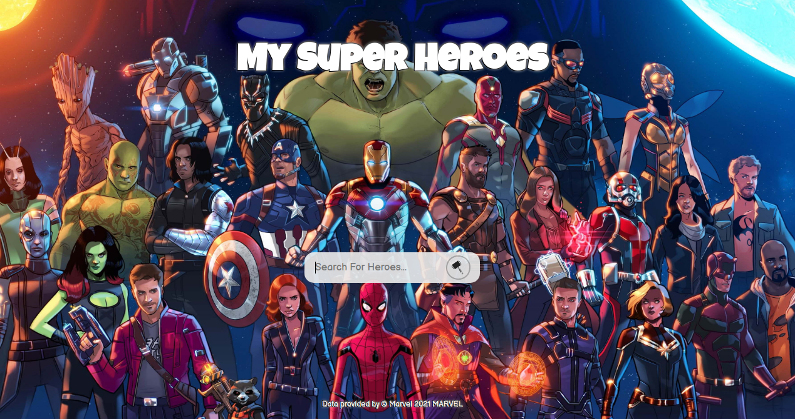

# My Super Heroes


## Tecnologias usadas:
| React.js |
| Typescript |
| Styled-Components |

---
## O app esta hospedado no netlify
[My Super Heroes](https://competent-kare-2af44f.netlify.app/)
---
## Usando o app localmente
Em primeiro lugar, você precisará das credenciais da Marvel. Caso queira usar minhas credenciais, entre em contato comigo pelo e-mail rafamlf.2011@protonmail.com ou você pode ver o aplicativo pelo link na seção acima.
Para executar este aplicativo localmente, você primeiro precisa clonar este repositório;
 ```
 git clone https://github.com/Rafhael1/desafio-marvel-api
 ```
agora basta instalar os módulos e iniciar o projeto.
 ```
yarn install
yarn start
 ``` 
 ---

